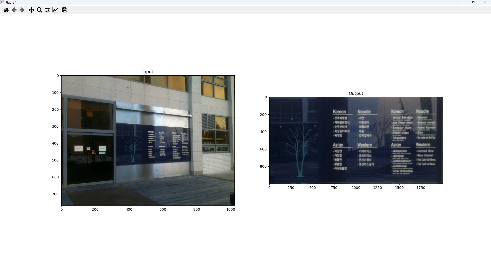

# IP2025
OpenCV-Python Tutorials

</img>

homework1

https://www.youtube.com/watch?v=gjT5rxG9CV8

homework2

https://www.youtube.com/watch?v=7k-LO_xAtfQ

Homework3
</img>

Homework5

https://youtu.be/anajFWYDJT4

